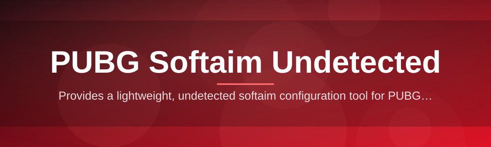
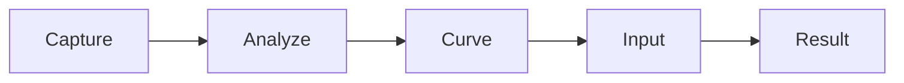

# pubg-softaim-companion 🎯🛰️

  

*A quiet, precise companion for PUBG players who want smoother aim assistance without the drama.*

  

## 🌱 Overview

This project started as a weekend itch. I kept reading threads about PUBG softaim tools that were either bloated, sketchy, or built by teams who clearly never touched the game themselves. So I built the version I actually wanted — a lightweight, standalone companion focused on one thing: helping your aim feel natural, not robotic.

**pubg-softaim-companion** is a Windows-native aim assistance layer designed around the idea that "undetected" isn't a marketing word — it's an engineering constraint. Every decision, from how input is smoothed to how the overlay renders, was made with detection footprint in mind first, comfort second. This isn't a flashy aimbot with snap-lock vibes. It's a soft aim assist companion tuned for legit-feeling movement curves.

It's built for solo players, small squads, and PUBG streamers who want consistent aim support that doesn't look like it came from a bot. If you've ever wanted a PUBG softaim experience that feels like *you*, just slightly sharper — this is the tool.

> [!NOTE]
> The download button above always points to the official landing page. That's the only place builds are published — no third-party mirrors, ever.

---

## ⚙️ What It Actually Does

| Capability | Why It Matters |
|---|---|
| **Human-curve smoothing** | Aim movement follows organic bezier curves instead of linear snaps, so it reads like real muscle memory. |
| **Adaptive sensitivity mapping** | Automatically reconciles your in-game DPI/sensitivity with assist strength, no manual math required. |
| **FOV-aware targeting logic** | Priority weighting respects your actual field of view instead of guessing screen-wide. |
| **Low-footprint overlay** | Rendered outside the game's memory space — nothing touches PUBG's process directly. |
| **Recoil-aware assist** | Understands weapon recoil patterns so assist doesn't fight your own compensation. |
| **Hotkey-first control** | Every core function is bindable, so you're never digging through menus mid-match. |
| **Session profiles** | Save distinct configs per weapon class, per map, or per mood. |
| **Silent background mode** | Runs minimized with near-zero CPU/GPU overhead when idle. |

> [!TIP]
> Start with the **Balanced** profile before tweaking curve aggressiveness — most detection-related paranoia comes from over-tuned settings, not the tool itself.

---

## 🚀 Getting Started

**Four steps. No dependencies. No terminal required.**

1. **Visit the landing page** — tap the download button above.
2. **Grab the latest build** — always versioned, always signed against the current PUBG patch.
3. **Run the executable** — it's standalone, no installer wizard, no bundled extras.
4. **Launch PUBG, then the companion** — order matters for the overlay hook to initialize cleanly.

> [!IMPORTANT]
> Always launch the companion **after** PUBG has fully loaded into the main menu. Launching it first can cause the overlay to miss its attach window.

---

## 🖥️ System Requirements

<strong>Click to expand full requirements</strong>

- Windows 10 (64-bit) or Windows 11
- No .NET, no runtime installs, no external dependencies
- 100 MB free disk space
- DirectX 11 or later (already required by PUBG)
- Administrator privileges for overlay initialization

  

---

## 🧠 How It Works

The companion operates as a passive observer, not an intruder. It reads screen-space data, calculates an adjusted aim vector, and feeds that back through smoothed input — never poking directly into PUBG's process memory.

1. **Capture** — grabs frame data via a non-invasive screen-space pass.
2. **Analyze** — identifies target priority using FOV and distance weighting.
3. **Curve** — generates a human-style movement path, not a straight line.
4. **Input** — translates that curve into smoothed mouse movement.
5. **Result** — your aim adjusts naturally, in real time.

---

## 🩹 Troubleshooting

**Q: The overlay isn't attaching to PUBG.**
A: Confirm you launched the companion *after* PUBG's main menu loaded, and that it's running as Administrator.

**Q: Aim assist feels too aggressive.**
A: Lower the curve intensity slider in Settings → Aim Curve. Most "robotic" feedback comes from maxed-out values.

**Q: My hotkeys stopped responding mid-match.**
A: Alt-tabbing sometimes drops the global hook. Re-focus the companion window once to restore it.

**Q: Does it work after a PUBG patch?**
A: Compatibility is tracked per patch — check the landing page for current build status before playing ranked.

**Q: Antivirus flagged the executable.**
A: Screen-capture and input-simulation tools commonly trigger heuristic flags. Add an exclusion if you trust the source.

> [!WARNING]
> Never run multiple instances of the companion simultaneously — conflicting input hooks can cause erratic cursor behavior.

---

## 🎨 UI / UX Details

**Themes** — Dark (default), Midnight Blue, and a high-contrast Tactical mode.

**Default keyboard shortcuts:**

| Action | Key |
|---|---|
| Toggle assist | `F1` |
| Cycle profiles | `F2` |
| Open settings | `F3` |
| Panic disable | `F9` |

Settings persist per profile, so switching weapon loadouts doesn't reset your tuning.

> [!TIP]
> Bind **Panic disable** to a key you can hit blind — it instantly zeroes all assist without closing the app.

---

## 🤝 Contributing & Community

Pull requests are genuinely welcome — this stays a passion project, not a corporate roadmap. Open an issue first for larger changes so we can talk direction before code gets written.

- Fork, branch, PR — standard flow
- Keep commits scoped and named clearly
- Discussions tab is open for feature ideas and general PUBG softaim talk

---

## 📜 License

Released under the [MIT License](LICENSE), 2026.

---

## ⚠️ Disclaimer

This project is provided for educational and research purposes around input smoothing and human-motion modeling. Use of any aim assistance tool may violate the terms of service of the game you're playing. You are solely responsible for how and where you use this software.

---

